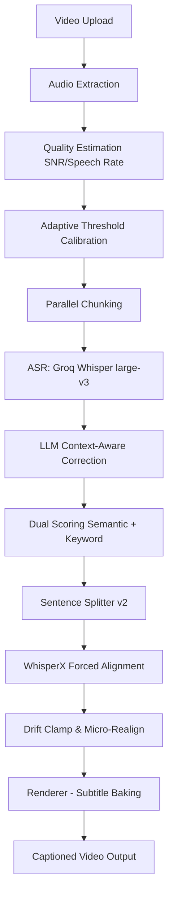

# 🎬 Caption AI v4.3 — Architecture D+++

[](https://opensource.org/licenses/MIT)
[](https://www.python.org/downloads/)
[](https://fastapi.tiangolo.com/)

**Caption AI** is a professional-grade, local-first video captioning engine. It autonomously generates millisecond-accurate, context-aware subtitles for videos in **Bengali, English, Hindi, and Hinglish**.

> *"System শুধু ঠিক না — পরিস্থিতি বুঝে best decision নেয়" (The system isn't just correct—it understands the context and makes the best decision).*

---

## 🚀 Key Features (v4.3 Upgrades)

| Feature | Description |
| :--- | :--- |
| **Adaptive Thresholds** | Audio-aware auto-tuning of accuracy thresholds per video. |
| **Hinglish Mastery** | Chunk-level language detection optimized for mixed Bengali/Hindi/English contexts. |
| **Millisecond Sync** | WhisperX-powered forced alignment with zero-overlap drift clamping. |
| **Enterprise Pipeline** | 15 core architectural upgrades ensuring zero-surprise outputs at scale. |
| **Beautiful Render** | Professional frame-by-frame subtitle baking with custom font styles. |

---

## 🏗 Architecture & Pipeline



---

## 🛠 Installation Guide

### Prerequisites
1.  **Python 3.10 to 3.12**: (Recommended version. Python 3.14+ may have dependency conflicts).
2.  **FFmpeg**: Must be installed and added to your system `PATH`.
3.  **Groq API Key**: Get your free key at [console.groq.com](https://console.groq.com/).

### Setup Steps
1.  **Clone the Repository**:
    ```bash
    git clone https://github.com/morningstarwebd/caption-ai-v4-3.git
    cd caption-ai-v4-3
    ```

2.  **Environment Variables**:
    Create a `.env` file in the root directory:
    ```env
    GROQ_API_KEY=your_groq_api_key_here
    FFMPEG_PATH=C:\path\to\ffmpeg.exe
    ```

3.  **Install Dependencies**:
    ```bash
    pip install -r requirements.txt
    ```

---

## 🖥 Usage

### Start the Backend Server
```bash
python -m server.main
# OR
uvicorn server.main:app --host 0.0.0.0 --port 8000
```

### Access Dashboard
Open your browser and navigate to:
`http://localhost:8000`

---

## 📂 Project Structure
-   `/ai_pipeline`: Core AI logic (Transcription, Alignment, Correction).
-   `/server`: FastAPI implementation and Job Management.
-   `/frontend`: Dashboard UI (React + Tailwind CDN).
-   `/storage`: Temporary uploads, logs, and processing outputs.

## 📄 License
This project is licensed under the MIT License - see the [LICENSE](LICENSE) file for details.

---
*Developed with ❤️ by the Caption AI Team.*
